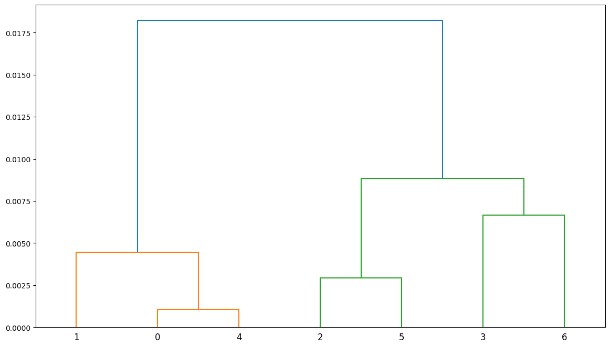
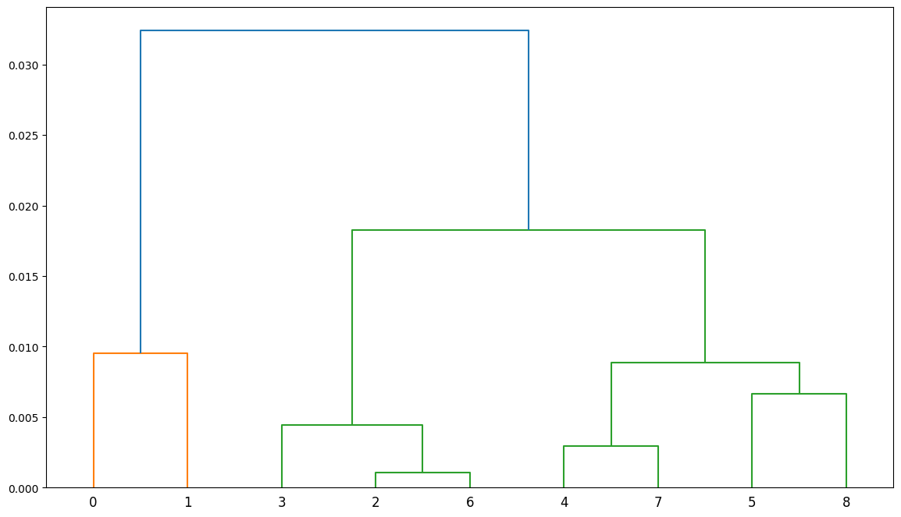
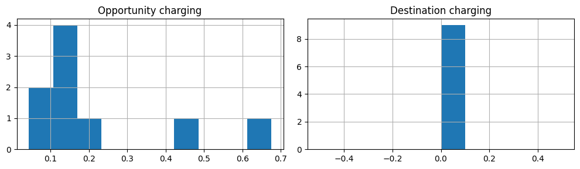
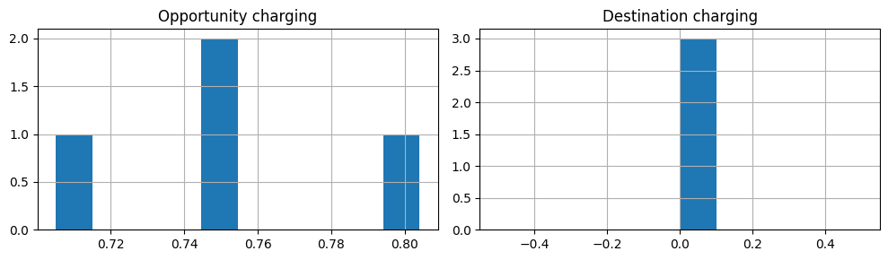

# EVCI Siting Tool

<!-- WARNING: THIS FILE WAS AUTOGENERATED! DO NOT EDIT! -->

## Install

Use github to access the repository, clone it on your local machine

`git clone git@github.com:mpensystems/evci-python-2.git` or

`git clone https://github.com/mpensystems/evci-python-2.git`

## How to use

The model inputs are provided in the form of excel files (xlsx). The
`analyze_sites()` is the entry level function and completes the analysis
for specified corridor

``` python
from evci_tool.config import *
from evci_tool.model import *
from evci_tool.analysis import *

ui_inputs = { 
    "planning_scenario": "Public places",
    "years_of_analysis": [1,2,3],
    "Ai": 50,
    "Li": 1500,
    "Bipc": .25,
    "Birate": 3.5,
    "Eg": 5.5,
    "backoff_factor":1,
    "cabling_cost": 500,
    "capex_2W": 2500,
    "capex_3WS": 112000,
    "capex_4WS": 250000,
    "capex_4WF": 1500000,
    "hoarding cost": 900000,
    "kiosk_cost": 180000,
    "year1_conversion": 0.02,
    "year2_conversion": 0.05,
    "year3_conversion": 0.1,
    "holiday_percentage": 0.3,
    "fast_charging": 0.3,
    "slow_charging": 0.15,
    "cluster": True,
    "cluster_th": 0.2,
    "plot_dendrogram": True
}


u_df = analyze_sites ('abc124','panaji',ui_inputs)
```

    Reading input files...done.

    Opportunity_charging Analysis

    Initial Analysis
    ________________

    Number of sites: 9/9
    Total capex charges = INR Cr 1.93
    Total opex charges = INR Cr 5.85
    Total Margin = INR Cr 47162.17
    confirmed sites with utilization > 20%: 2
    {'no_site': '9/9', 'capex': '1.93', 'opex': '5.85', 'margin': '47162.17', 'confirmed_utilization': '20%: 2'}
    candidates for clustering:  7
    confirmed sites with utilization > 20%: 2
    final list:  4

    Cluster Analysis
    ________________

    Number of sites: 4/9
    Total capex charges = INR Cr 0.86
    Total opex charges = INR Cr 5.52
    Total Margin = INR Cr 71369.85
    confirmed sites with utilization > 20%: 4
    {'no_site': '4/9', 'capex': '0.86', 'opex': '5.52', 'margin': '71369.85', 'confirmed_utilization': '20%: 4'}

    Destination_charging Analysis

    Initial Analysis
    ________________

    Number of sites: 9/9
    Total capex charges = INR Cr 1.93
    Total opex charges = INR Cr 3.12
    Total Margin = INR Cr 1.12
    confirmed sites with utilization > 20%: 0
    {'no_site': '9/9', 'capex': '1.93', 'opex': '3.12', 'margin': '1.12', 'confirmed_utilization': '20%: 0'}
    candidates for clustering:  9
    confirmed sites with utilization > 20%: 0
    final list:  3

    Cluster Analysis
    ________________

    Number of sites: 3/9
    Total capex charges = INR Cr 0.64
    Total opex charges = INR Cr 1.04
    Total Margin = INR Cr 0.37
    confirmed sites with utilization > 20%: 0
    {'no_site': '3/9', 'capex': '0.64', 'opex': '1.04', 'margin': '0.37', 'confirmed_utilization': '20%: 0'}

    100%|██████████| 9/9 [00:15<00:00,  1.76s/it]
    100%|██████████| 4/4 [00:06<00:00,  1.75s/it]
    100%|██████████| 9/9 [00:04<00:00,  2.24it/s]
    100%|██████████| 3/3 [00:01<00:00,  2.56it/s]





``` python
import matplotlib.pyplot as plt

fig, (ax1,ax2) = plt.subplots(1,2, figsize=(10,3))
u_df['opportunity_charging']['initial'].hist(column='utilization',ax=ax1);
u_df['destination_charging']['initial'].hist(column='utilization',ax=ax2);
ax1.title.set_text('Opportunity charging')
ax2.title.set_text('Destination charging')
plt.tight_layout()
```



``` python
fig, (ax1,ax2) = plt.subplots(1,2, figsize=(10,3))
u_df['opportunity_charging']['cluster'].hist(column='utilization',ax=ax1);
u_df['destination_charging']['cluster'].hist(column='utilization',ax=ax2);
ax1.title.set_text('Opportunity charging')
ax2.title.set_text('Destination charging')
plt.tight_layout()
```


